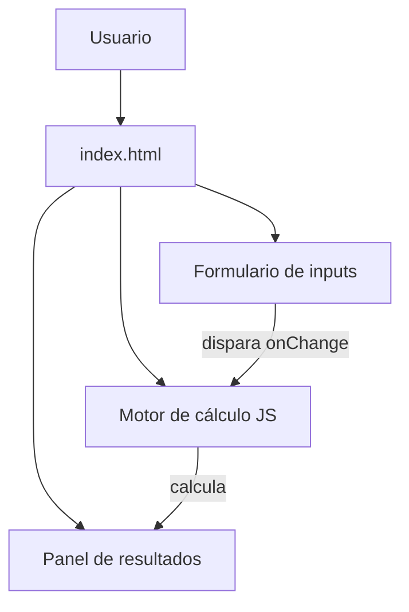

# Arquitectura técnica

---

## Stack seleccionado

| Capa | Tecnología | Justificación |
|------|-----------|---------------|
| Framework | HTML5 + CSS3 + JavaScript vanilla | Sin dependencias, funciona offline, despliegue trivial |
| Base de datos | Ninguna | Calculadora puramente client-side |
| Autenticación | Ninguna | No se requiere |
| Estilos | CSS custom (variables + grid/flex) | Sin frameworks externos, control total, bundle 0 |
| Despliegue | GitHub Pages / cualquier hosting estático | Un solo archivo HTML |

---

## Diagrama de componentes



---

## Estructura de carpetas

```
LINO/
├── index.html          → Calculadora completa (HTML + CSS + JS inline)
├── README.md           → Documentación de uso
├── CLAUDE.md           → Instrucciones para agentes de codificación
├── docs/               → Documentación del proyecto
│   ├── prd.md
│   ├── architecture.md
│   ├── data-model.md
│   ├── design-system.md
│   ├── business.md
│   └── roadmap.md
├── changelog/          → Registro de cambios
└── mejoras/            → Ideas futuras
```

---

## Fórmulas matemáticas (núcleo de la calculadora)

### Factor de salud (Health Factor)
```
HF = (Valor Colateral USD × Liquidation Threshold) / Deuda Total USD
```
- HF > 1: posición segura
- HF = 1: umbral de liquidación
- HF < 1: posición liquidable

### Precio de liquidación
```
Precio_liq = (Deuda USD × Precio_actual) / (Valor_colateral USD × Liquidation_threshold)
```
Derivación: cuando el precio cae a P_liq, el colateral vale `Colateral_USD × (P_liq / P_actual)`.
En ese punto HF = 1, por tanto:
```
1 = (Colateral_USD × (P_liq / P_actual) × LT) / Deuda_USD
P_liq = (Deuda_USD × P_actual) / (Colateral_USD × LT)
```

### LTV actual
```
LTV_actual = (Deuda USD / Valor Colateral USD) × 100
```

### Caída necesaria para liquidación
```
Caída% = ((Precio_actual - Precio_liq) / Precio_actual) × 100
```

### Colateral recibido por liquidador (liquidación parcial, 50% de deuda)
```
Deuda_cubierta = Deuda_USD × 0.5
Colateral_liquidado_USD = Deuda_cubierta × (1 + Liquidation_bonus)
```

---

## Estrategia de autenticación

No aplica.

---

## Integraciones externas

Ninguna. La calculadora es 100% offline.

---

## Estrategia de despliegue

Abrir `index.html` directamente en el navegador, o subir a cualquier hosting estático (GitHub Pages, Netlify, Vercel).

---

## Decisiones técnicas relevantes

### 2026-05-11 — HTML/CSS/JS vanilla sin frameworks
**Contexto:** es una calculadora sin estado persistente ni rutas.  
**Opciones consideradas:** React + Vite, Svelte, vanilla.  
**Decisión:** vanilla — cero dependencias, funciona offline, un solo archivo, despliegue inmediato.  
**Consecuencias:** si crece mucho en complejidad, migrar a un framework ligero sería el siguiente paso.
